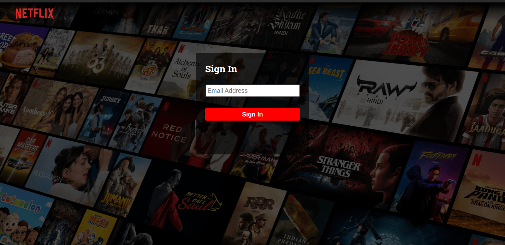

# Nextflix using Next.js

## About

Simple Netflix clone with [Next.js](https://nextjs.org/), [Hasura GraphQL](https://hasura.io/) and [Magic](https://magic.link/).

## 1. Getting Started

First clone this repository.

```
git clone https://github.com/sakilk130/nextflix.git
```

Install dependencies. Make sure you already have [`nodejs`](https://nodejs.org/en/) & [`yarn`](https://yarnpkg.com/) installed in your system.

```
yarn
```

Copy .env.example to .env.local and fill all the values.

```
cp .env.example .env.local
```

Run the development server:

```
yarn dev
```

## Screenshot of the Web App



## Built with

- <a href="https://nextjs.org/">Next.js</a>
- <a href="https://www.typescriptlang.org/">TypeScript</a>
- <a href="https://www.framer.com/motion/">Framer Motion</a>
- <a href="https://magic.link/">Magic Auth</a>
- <a href="https://hasura.io/">Hasura GraphQL</a>
